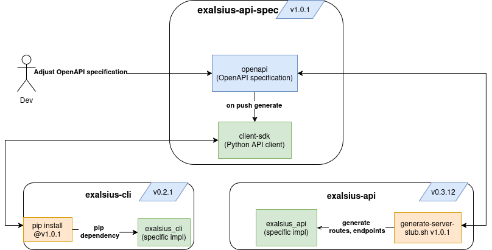

<h1 align="center">
  <br>
   <br>
    exalsius API Specification
<br>
</h1>

This repository defines the OpenAPI contract for the exalsius REST API and automates the generation of client SDKs. It ensures consistency and reliability between the [exalsius-api](https://github.com/exalsius/exalsius-api) backend and the [exalsius-cli](https://github.com/exalsius/exalsius-cli) client.

## Overview
This repository ensures alignment between:
- **[exalsius-api](https://github.com/exalsius/exalsius-api)** – the REST API implementation.
- **[exalsius-cli](https://github.com/exalsius/exalsius-cli)** – the CLI tool consuming the API via the generated Python client SDK.

It provides:
- **OpenAPI Specification**: Defines the exalsius REST API in the `openapi/` directory.
- **Client SDK Generation**: A Python client SDK library for interacting with the REST API.
- **Automated CI/CD**: Linting, validation, and SDK testing on every change.
- **Contribution Workflow**: Documentation and tooling to help contributors propose and validate API changes.

## Makefile Targets
The repository provides several `make` targets to simplify common tasks.  
**Docker is required** to run these targets, as all tools are containerized to avoid local environment dependencies.

### Available Targets

| Target                  | Description                                                                                     |
|------------------------|-------------------------------------------------------------------------------------------------|
| `make lint`             | Lints and validates the OpenAPI specification using Redocly CLI.                                |
| `make build`            | Bundles the OpenAPI specification into `dist/bundle.yaml` using Redocly CLI.                    |
| `make run-redocly`      | Starts a local Redocly Preview server at `http://localhost:8080` to view the API documentation.  |
| `make run-swagger`      | Starts a local Swagger UI server at `http://localhost:8081` to explore the API.                 |
| `make mock-server`      | Starts a mock server using Prism at `http://localhost:4010` based on the bundled specification.  |
| `make generate`         | Generates the Python client SDK using `scripts/generate-client.sh`.                             |


## Contribution and Release Workflow: Instructions
<h1 align="center">
  <br>
   <br>
<br>
</h1>

The diagram above explains how changes to the API specification are managed and how client SDKs and server stubs are generated.

### How to propose API Changes

1. **Edit the OpenAPI Specification**  
   Make your changes to the OpenAPI specification in `openapi/`. This includes:
   - Adding or updating **endpoint routes**.
   - Modifying **request or response schemas**.
   - Adjusting **descriptions or metadata**.

2. **Validate Your Changes Locally**  
   Run the following to validate and lint your changes:
   ```bash
   make lint
   ```

3. **Open a Pull Request**

   Submit your changes via a Pull Request. Automated CI will also lint and test the changes.

4. **Merge and Automation**

   Once the PR is merged into `main`, the pipeline will:

   * Rebuild the Python client SDK in `client-sdk/`.
   * Optionally release a new version using `release-please`.

### Releasing New Versions

Version management and releases are automated via [release-please](https://github.com/googleapis/release-please).
Create a release Pull Request by following the repository’s release process to publish a new version of the API specification and the generated SDK.

### Using the Python Client SDK

After a new SDK version is released, it can be installed in **`exalsius-cli`** or any other Python project:

#### Example with pip:

```bash
pip install git+https://github.com/exalsius/exalsius-api-spec.git@<version>#subdirectory=client-sdk
```

#### Example with uv:

```bash
uv "pip install git+https://github.com/exalsius/exalsius-api-spec.git@<version>#subdirectory=client-sdk"

```

Replace `<version>` with the released version tag, for example `1.2.3`.

### Generating Server Stubs

The **[exalsius-api](https://github.com/exalsius/exalsius-api)** repository provides a `generate-server.sh` script to generate FastAPI routers and models based on a specific version of the API specification.
Use `generate-server.sh -l /path/to/bundle.yml` in the **[exalsius-api](https://github.com/exalsius/exalsius-api)** repository.  

For details, see the **exalsius-api** repository’s [README](https://github.com/exalsius/exalsius-api).
